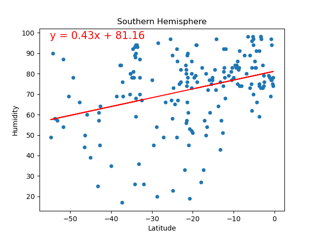
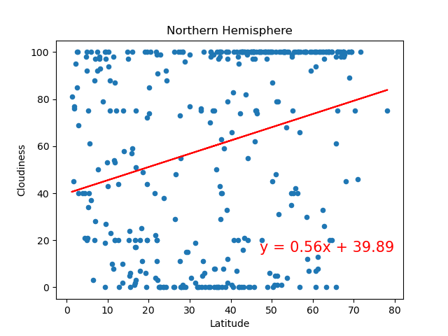
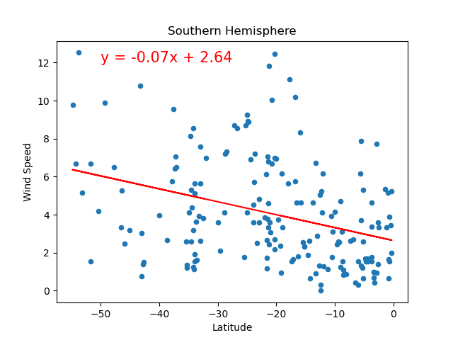

# Module 6 Challenge

## 
Background / Scenario
 
Data's true power is its ability to definitively answer questions. So, let's take what you've learned about Python requests, APIs, and JSON traversals to answer a fundamental question: "What is the weather like as we approach the equator?"

Now, we know what you may be thinking: “That’s obvious. It gets hotter.” But, if pressed for more information, how would you prove that?
 

## 
Part 1 | WeatherPy
 

In this deliverable, you'll create a Python script to visualize the weather of over 500 cities of varying distances from the equator. You'll use the citipy Python libraryLinks to an external site, the OpenWeatherMap APILinks to an external site, and your problem-solving skills to create a representative model of weather across cities.

### Requirement 1: Create Plots to Showcase the Relationship Between Weather Variables and Latitude

<ins>Final Script Outputs</ins>:   

 

### Requirement 2: Compute Linear Regression for Each Relationship

<ins>Final Script Outputs</ins>:   

 

## 
Part 2 | VacationPy
 

In this deliverable, you'll use your weather data skills to plan future vacations. Also, you'll use Jupyter notebooks, the geoViews Python library, and the Geoapify API.

Create a map that displays a point for every city in the previous WeatherPy data. The size of the point reflects the humidity in each city.

<ins>Final Script Outputs</ins>:   

 

Narrow down the cities to reflect only those that are what you consider to have "ideal weather conditions." Create a map that displays a point for each of these cities with hover-over information with the nearest hotel. The size of the point reflects the humidity in each city.

<ins>Final Script Outputs</ins>:   

 

## 
References

 
 
 

       

