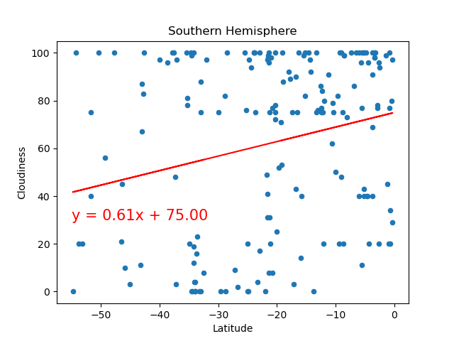
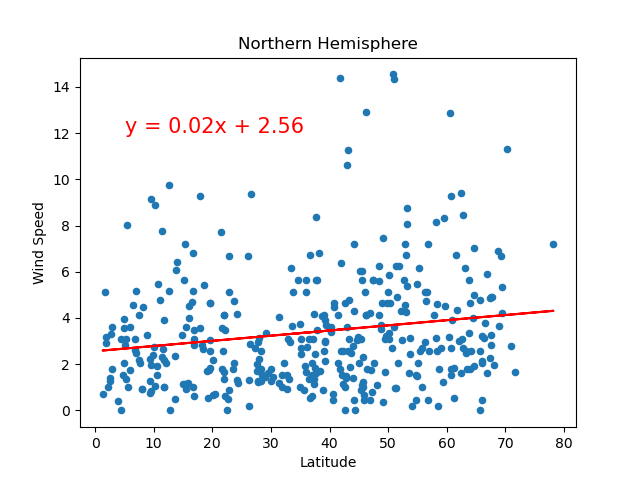

# Module 6 Challenge

## 
Background / Scenario
 
Data's true power is its ability to definitively answer questions. So, let's take what you've learned about Python requests, APIs, and JSON traversals to answer a fundamental question: "What is the weather like as we approach the equator?"

Now, we know what you may be thinking: “That’s obvious. It gets hotter.” But, if pressed for more information, how would you prove that?
 

## 
Part 1 | WeatherPy
 

In this deliverable, you'll create a Python script to visualize the weather of over 500 cities of varying distances from the equator. You'll use the citipy Python libraryLinks to an external site, the OpenWeatherMap APILinks to an external site, and your problem-solving skills to create a representative model of weather across cities.

### Requirement 1: Create Plots to Showcase the Relationship Between Weather Variables and Latitude

<ins>Final Script Outputs</ins>:   

 

### Requirement 2: Compute Linear Regression for Each Relationship

<ins>Final Script Outputs</ins>:   
  
  
**Discussion about the linear relationship:** The data reflects a clear correlation between latitude and temperature in both hemispheres, negative in the northern and positive in the southern. No surprises here... as you get closer and further from the equator, the weather and sun exposure changes affecting temperature with the warmest temperatures at the equator. The r-value of 0.83 for the northern hemisphere indicates a particularly strong representation.  
  
  
**Discussion about the linear relationship:** Both the southern and northern hemisphere data shows a mildly positive relationship between latitude and humidity. With low r-values of 0.34 and 0.36 respectively, there are likely other factors in play. For example, we would need to consult a psychrometric chart to read the inter-dependence of the hudmidity ratio, dry bulb temperature, and wet bulb temperature. Air pressure also plays a big role in this relationship (how far above or below sea level are you).  
  
  
**Discussion about the linear relationship:** Based on the r-values of 0.27 and 0.24, the northern and southern hemisphere cloudiness and latitude are not strongly linearly related. A regression is not a good fit with this data.  
  
  
**Discussion about the linear relationship:** The northern hemisphere regression of latitude vs wind speed is nearly flat with a very low r-value of 0.17 indicating that the data is not well-represented by a linear relationship. The southern hemisphere regression shows a very mild negative relationship with an r value of -0.35 indicating that the relationship still may be too loose to consider it to be linear.  
 

## 
Part 2 | VacationPy
 

In this deliverable, you'll use your weather data skills to plan future vacations. Also, you'll use Jupyter notebooks, the geoViews Python library, and the Geoapify API.

Create a map that displays a point for every city in the previous WeatherPy data. The size of the point reflects the humidity in each city.

<ins>Final Script Outputs</ins>:   

 

Narrow down the cities to reflect only those that are what you consider to have "ideal weather conditions." Create a map that displays a point for each of these cities with hover-over information with the nearest hotel. The size of the point reflects the humidity in each city.

<ins>Final Script Outputs</ins>:   

 

## 
References

OpenWeather API: https://openweathermap.org/api  
Geoapify Geocoding API: https://www.geoapify.com/geocoding-api  
Geoapify Places API: https://www.geoapify.com/places-api  

Python Libraries: pandas, requests, matplotlib, numpy, scipy, citipy, hvPlot
 
 
 

       

